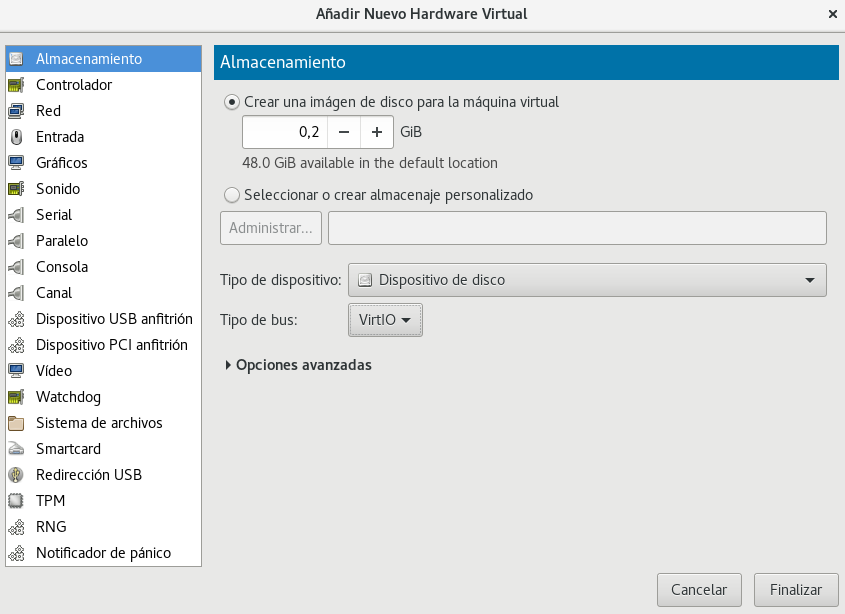

## Gestió de Volums Lògics
+ #####  Què són?
    -Són una capa d'extracció entre dispositius d'emmagatzematge i un sistema de fitxers. Tambè és anomenat Logical Volume Manager (LVM).
* ##### Què volen dir les sigles, definició, analogies i exemples de comandes (explicant què fan) vistes a classe de:
__PV:__

  -Aquestes sigles volen dir Physical Volume (Volum Físic).

  -És un dispositiu d'emmagatzematge o, més ben dit, un dispositiu de blocs.

  -Podria ser un Disc Dur, una partició, una targeta SD, un floppy, un dispositiu RAID, un dispositiu loop, un dispositiu de xifrat o inclós un Volumen Lògic (LV).
    
        pvcreate /dev/vda → Crea un Physical Volume del Disc Dur /dev/vda.
    
        pvs → Veure els Volums Físics que hi tenim al nostre PC.
    
    
__VG:__
    
  -Aquestes sigles volen dir Volume Group (Volum de Grup).
    
  -Es podria dir que VG és una espècie de disc dur virtual. Està compost d'un o més PVs.
    
  -És la "caixa" en la que tenim les nostres Volums Lògics (LV) i els nostres Volums Físics (PV)
    
        vgcreate multimedia /dev/vda → Crea un Volume Group
        
        vgs → Veure els Volums de Grup que hi tenim al PC.
    
    
__LV:__
    
  -Aquestes sigles volen dir Logical Volume (Volum Lògic).
  
  -Particions dins dels Volums Lògics creats.
  
        lvcreate -L 250M -n videos multimedia → Crea un Volum Lògic de 250 Mb amb el nom de videos dins del Volum de grup multimedia.
        
+ ##### Entorn de pràctiques: Explicar com farem la pràctica detalladament (màquina virtual i afegir tres discs de 200M)
  -En aquesta pràctica crearem tots els tipus de LVM que hi han a través de comandes.  
  

 

+ #### Pràctica 1: Creació d'un volum lògic a partir d'un dels tres discs durs (vda per exemple). Aquest volum lògic ha de ser del total de capacitat del disc. El volum de grup s'ha de dir practica1 i el volum lògic dades.
(pistes:  ...pvcreate /dev/vda ....  ...vgcreate practica1 /dev/vda....  lvcreate -l 100%FREE ..... )

```
[root@localhost ~]# pvcreate /dev/vda /dev/vdb
  Physical volume "/dev/vda" successfully created.
  Physical volume "/dev/vdb" successfully created.
  ```
  Comprovem que està ben creat:
  
  ```
  [root@localhost ~]# pvs
  PV         VG Fmt  Attr PSize   PFree  
  /dev/vda      lvm2 ---  204.80m 204.80m
  /dev/vdb      lvm2 ---  204.80m 204.80m
  ```
  
  Creem el Volum de Grup:
  ```
  [root@localhost ~]# vgcreate practica1 /dev/vda
  Volume group "practica1" successfully created
  ```
  
  Comprovem que està creat:
  ```
  root@localhost ~]# vgs
  VG        #PV #LV #SN Attr   VSize   VFree  
  practica1   1   0   0 wz--n- 200.00m 200.00m

  ```
  
  Per últim creem el Volum Lògic:
  ```
  [root@localhost ~]# lvcreate -l 100%FREE -n dades practica1
  Logical volume "dades" created.

  ```
  
  Y comprovem que està creat:
  ```
  [root@localhost ~]# lvs
  LV    VG        Attr       LSize   Pool Origin Data%  Meta%  Move Log Cpy%Sync Convert
  dades practica1 -wi-a----- 200.00m
  ```
  
  
  + #### Pràctica 2: Creació d'un sistema de fitxers xfs al volum lògic creat i muntatge a /mnt. També s'ha de crear un fitxer amb dd de 180MB.
(pistes: ....mkfs.xfs /dev/practica1/dades ..... mount /dev/practica1/dad ....  /mnt)

Creem el sistema de fitxers xfs:
```
[root@localhost ~]# mkfs.xfs /dev/practica1/dades 
meta-data=/dev/practica1/dades   isize=512    agcount=4, agsize=12800 blks
         =                       sectsz=512   attr=2, projid32bit=1
         =                       crc=1        finobt=1, sparse=0
data     =                       bsize=4096   blocks=51200, imaxpct=25
         =                       sunit=0      swidth=0 blks
naming   =version 2              bsize=4096   ascii-ci=0 ftype=1
log      =internal log           bsize=4096   blocks=855, version=2
         =                       sectsz=512   sunit=0 blks, lazy-count=1
realtime =none                   extsz=4096   blocks=0, rtextents=0
```

Ara montem a /mnt
```
[root@localhost ~]# mount /dev/practica1/dades /mnt
```

Creem el fitxer de 180MB:
```
[root@localhost ~]# dd if=/dev/zero of=tes1.img bs=1K count=180000
180000+0 records in
180000+0 records out
184320000 bytes (184 MB, 176 MiB) copied, 0.340581 s, 541 MB/s
```

+ #### Pràctica 3: Creació d'un RAID 1 als dos discos sobrants (vdb i vdc per exemple)
(pistes: .... mdad.... --creat.. /dev/md0 --lev..=mirr.... --raid-devices=1 /dev/vdb /dev/vdc   comprobar fent cat /proc/mdstat......)

Creem un RAID 1 amb els dos discs sobrants:
```
[root@localhost ~]# mdadm --create /dev/md0 --level=1 --raid-devices=2 /dev/vdb /dev/vdc
mdadm: Note: this array has metadata at the start and
    may not be suitable as a boot device.  If you plan to
    store '/boot' on this device please ensure that
    your boot-loader understands md/v1.x metadata, or use
    --metadata=0.90
Continue creating array? yes 
mdadm: Defaulting to version 1.2 metadata
mdadm: array /dev/md0 started.
```

Y comprovem que està creat:
```
[root@localhost ~]# cat /proc/mdstat 
Personalities : [raid1] 
md0 : active raid1 vdc[1] vdb[0]
      209536 blocks super 1.2 [2/2] [UU]
      
unused devices: <none>
```


+ #### Pràctica 4: Ampliació del volum lògic de dades al raid
(pistes: pvcreate /dev/md0 .....vgextend practica1 /dev/md0 ...... lvextend -l 100%FREE /dev/practica1/dades......comprobar amb: lsbl.... i df -h )
